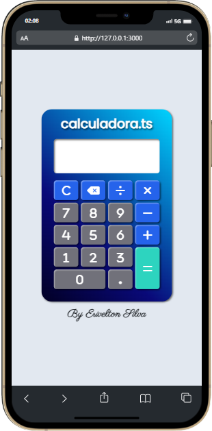

<h1># Calculadora.ts</h1>

Este projeto foi feito para eu pôr em prática os meus conhecimentos em typescript. Também pratiquei flexbox e grid do css para fazer o layout do app.

<h3>Tecnologias usadas:</h3>
<ul>
  <li>HTML5</li>
  <li>CSS3</li>
  <li>SASS</li>
  <li>TypeScript</li>
</ul>

<h3>Deploy:</h3>

  <a href="https://codepen.io/eriveltondasilva/full/gOBXNBR">Clique aqui</a>
  para ver este projeto em funcionamento.

